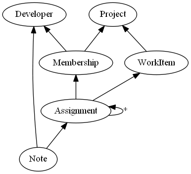

# What is Historical Modeling?

Historical Modeling is a method of distributed smart client software construction. It is based on a model of software behavior as a graph of partially ordered facts.

Download the reference implementation [Mathematicians](https://github.com/michaellperry/Mathematicians) for a full working example, including a SQL database, REST API, and client application.

This concept is manifested in the [Jinaga](http://jinaga.com) and [Correspondence](http://correspondencecloud.com) frameworks.

The idea of historical modeling is to record changes to a system, instead of its state. The current state of a system can be calculated from a history of changes, but not the other way around. The history contains more information than the state.

For example, in the above model, you can follow the history of assignments of a work item to various developers. The developer must be a member of a project before an item can be assigned to her. An assignment replaces a prior assignment, as indicated by the self-reference.

History makes a number of operations easy that are difficult when dealing with state. Recognizing and resolving conflicts between two parties, caching and synchronizing changes, and durably transmitting messages all become simple operations. In traditional state-based modeling, these operations require complex algorithms or specialized tools. These operations, however, are natural by-products of a historical model.

There are, on the other hand, several operations that a historical model does not perform as well as a state-based model. Searching a large set of data and generating aggregate reports, while simple operations in a relational database, are difficult in a history. It is best to integrate a historical model with a relational model for searching and reporting. A few simple techniques keep these two models in sync.

